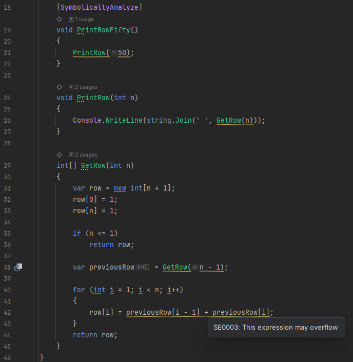
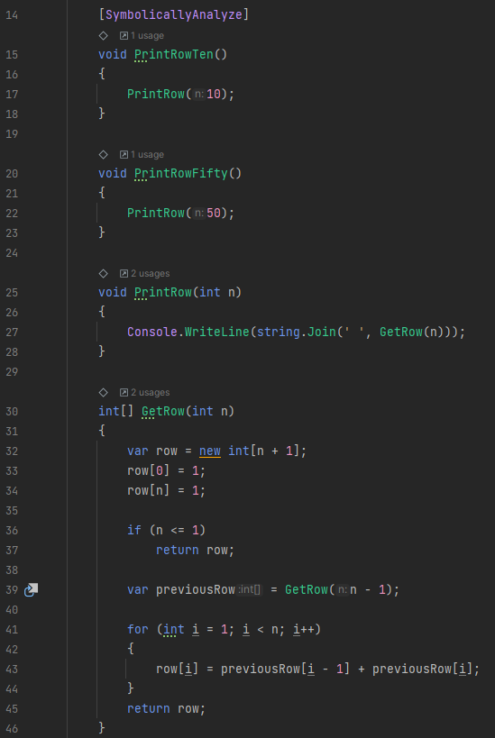

# Symbolic Execution Analyzer

[](https://codecov.io/gh/twoltjer/SymbolicExecutionAnalyzer) [](https://www.codefactor.io/repository/github/twoltjer/symbolicexecutionanalyzer) [](https://github.com/twoltjer/SymbolicExecutionAnalyzer/actions/workflows/build.yml)

A C# analyzer which performs symbolic execution on users' code and determines if it will overflow or throw unhandled exceptions. This tool integrates with the compiler through a NuGet package, which analyzes the code at compile time. It can also be used as a Visual Studio extension. 


# Usage Walkthrough

## Method 1: NuGet Package (recommended)

### Install prerequisites

- .NET 6.0 SDK from https://dotnet.microsoft.com/download/dotnet/6.0

### Build tests and control package

The tests depend on the analyzer project and control package, so they can all be built together with the following command:

```bash
dotnet build SymbolicExecution/SymbolicExecution.Test
```

### Run tests

With this project in particular, it is important to run the test suite. It will verify not only the source code, but the control package produced by the build.

```bash
dotnet test SymbolicExecution/SymbolicExecution.Test
```

### Build analyzer package

The analyzer package can be built with the following command:

```bash
dotnet build SymbolicExecution/SymbolicExecution.Package
```

After this command, both Nuget package files should have been placed in the `SymbolicExecution/PackageBuild` directory. It's recommended that this is verified:

```bash
$ ls SymbolicExecution/PackageBuild
SymbolicExecution.0.0.3.3.nupkg  SymbolicExecution.Control.0.0.3.3.nupkg
```

### Create demonstration project

In different directory (not in this git repository!), create a new C# Console Application project in a new directory:

```bash
mkdir SymbolicExecutionDemo
cd SymbolicExecutionDemo
dotnet new console
```

Continue with the "Set up demonstration project" section below.

## Method 2: Visual Studio Extension

### Install prerequisites

- Visual Studio 2022 (Community Edition is fine)
- .NET 6.0 SDK from https://dotnet.microsoft.com/download/dotnet/6.0
- .NET Compiler Platform SDK (available in Visual Studio installer)

### Open and build solution

Open the SymbolicExecutionAnalyzer.sln file in Visual Studio 2022.

Build the solution in Visual Studio. If the build fails, ensure that the prerequisites are installed.

After opening the solution, use visual studio to build the solution, and then run the `SymbolicExecution.Vsix` project. This will open a new instance of Visual Studio with the extension installed.

Continue with the "Create demo solution" section below.

### Create new project

Create a new C# Console Application project.

Continue with the "Set up demonstration project" section below.

## Set up demonstration project

### Exploring Pascal's triangle in C#

Open Project.cs (should have been created with the project) and replace the contents with the following:

```csharp
namespace SymbolicExecutionDemo;

class TestClass
{
    public static void Main()
    {
        var testClass = new TestClass();
        testClass.PrintRow(0);
        testClass.PrintRow(1);
        testClass.PrintRow(2);
        testClass.PrintRow(3);
        testClass.PrintRow(4);
        testClass.PrintRow(5);
        testClass.PrintRow(6);
    }

    void PrintRowTen()
    {
        PrintRow(10);
    }

    void PrintRowFifty()
    {
        PrintRow(50);
    }

    void PrintRow(int n)
    {
        Console.WriteLine(string.Join(' ', GetRow(n)));
    }

    int[] GetRow(int n)
    {
        var row = new int[n + 1];
        row[0] = 1;
        row[n] = 1;

        if (n <= 1)
            return row;

        var previousRow = GetRow(n - 1);

        for (int i = 1; i < n; i++)
        {
            row[i] = previousRow[i - 1] + previousRow[i];
        }
        return row;
    }
}
```

Save, build, and run it, and you should see something like the following output:

```bash
$ dotnet build

Build succeeded.
    0 Warning(s)
    0 Error(s)
    
$ dotnet run
1
1 1
1 2 1
1 3 3 1
1 4 6 4 1
1 5 10 10 5 1
1 6 15 20 15 6 1
```

This shows the first six rows of Pascal's triangle. Each row is calculated from the two adjacent values in the previous row, with the first and last values always being 1.

Modify the `Main()` method to call `PrintRowTen()`:

```csharp
public static void Main()
{
    var testClass = new TestClass();
    testClass.PrintRowTen();
}
```

Save, build, and run it, and you should see something like the following output:

```bash
$ dotnet build

Build succeeded.
    0 Warning(s)
    0 Error(s)
    
$ dotnet run
1 10 45 120 210 252 210 120 45 10 1
```

This is just the values from the 11th row (index 10) of Pascal's triangle.

Modify the `Main()` method to call `PrintRowFifty()`:

```csharp
public static void Main()
{
    var testClass = new TestClass();
    testClass.PrintRowFifty();
}
```

Again, save, build, and run it.

```bash
$ dotnet build

Build succeeded.
    0 Warning(s)
    0 Error(s)
    
$ dotnet run
```

In the output from the program, notice how several values are now negative. This is due to an integer overflow in the `GetRow()` method. The compiler and IDE provided no warnings or errors about this.

### Add Symbolic Execution Analyzer

In the test project directory, add a `NuGet.Config` configuration file, which adds the path to the PackageBuild directory checked above. 

Note that the path may be slightly different depending on your system.

```xml
<?xml version="1.0" encoding="utf-8"?>
<configuration>
  <packageSources>
    <add key="nuget.org" value="https://api.nuget.org/v3/index.json" protocolVersion="3" />
    <add key="local" value="C:\Users\thomas.woltjer\source\repos\SymbolicExecutionAnalyzer\SymbolicExecution\PackageBuild" />
  </packageSources>
  <packageRestore>
    <add key="enabled" value="True" />
    <add key="automatic" value="True" />
  </packageRestore>
  <bindingRedirects>
    <add key="skip" value="False" />
  </bindingRedirects>
  <packageManagement>
    <add key="format" value="0" />
    <add key="disabled" value="False" />
  </packageManagement>
</configuration>
```

This file will add a new package source to the project, which will allow the project to use the locally built version of the analyzer and control packages.

Add a reference to the `SymbolicExecution` and `SymbolicExecution.Control` packages to the project. 

```bash
$ dotnet add package SymbolicExecution
$ dotnet add package SymbolicExecution.Control
```

Edit the Program.cs file to import the `SymbolicExecution.Control` namespace, and apply the `SymbolicallyAnalyze` attribute to the `PrintRowTen()` method:

```csharp
using SymbolicExecution.Control;

namespace SymbolicExecutionDemo;

class TestClass
{
    public static void Main()
    {
        var testClass = new TestClass();
        testClass.PrintRowFifty();
    }

    [SymbolicallyAnalyze]
    void PrintRowTen()
    {
        PrintRow(10);
    }

    void PrintRowFifty()
    {
        PrintRow(50);
    }

    void PrintRow(int n)
    {
        Console.WriteLine(string.Join(' ', GetRow(n)));
    }

    int[] GetRow(int n)
    {
        var row = new int[n + 1];
        row[0] = 1;
        row[n] = 1;

        if (n <= 1)
            return row;

        var previousRow = GetRow(n - 1);

        for (int i = 1; i < n; i++)
        {
            row[i] = previousRow[i - 1] + previousRow[i];
        }
        return row;
    }
}
```

Save, build, and run it. It should behave exactly as before.

Now, add the symbolically analyze attribute to the `PrintRowFifty()` method:

```csharp
[SymbolicallyAnalyze]
void PrintRowFifty()
{
    PrintRow(50);
}
```

Save and build the project. Four build warnings should be shown:

```bash
$ dotnet build
C:\Users\thomas.woltjer\source\repos\SymbolicExecutionDemo\SymbolicExecutionDemo\Program.cs(48,22): warning SE0003: This expression may overflow [C:\Users\thomas.woltjer\source\repos\SymbolicExecutionDemo\Sy
mbolicExecutionDemo\SymbolicExecutionDemo.csproj]
C:\Users\thomas.woltjer\source\repos\SymbolicExecutionDemo\SymbolicExecutionDemo\Program.cs(27,9): warning SE0003: This expression may overflow [C:\Users\thomas.woltjer\source\repos\SymbolicExecutionDemo\Sym
bolicExecutionDemo\SymbolicExecutionDemo.csproj]
C:\Users\thomas.woltjer\source\repos\SymbolicExecutionDemo\SymbolicExecutionDemo\Program.cs(32,44): warning SE0003: This expression may overflow [C:\Users\thomas.woltjer\source\repos\SymbolicExecutionDemo\Sy
mbolicExecutionDemo\SymbolicExecutionDemo.csproj]
C:\Users\thomas.woltjer\source\repos\SymbolicExecutionDemo\SymbolicExecutionDemo\Program.cs(44,27): warning SE0003: This expression may overflow [C:\Users\thomas.woltjer\source\repos\SymbolicExecutionDemo\Sy
mbolicExecutionDemo\SymbolicExecutionDemo.csproj]
    4 Warning(s)
    0 Error(s)
```

Each of these warnings is shown either on the line where the overflow occurs, or on a method invocation on the execution path which causes the overflow. This can be more easily seen in an IDE:



Turning off analysis on PrintRowFifty() will remove the warnings, even when PrintRowTen() is still symbolically analyzed. This is because the analyzer is able to determine that all callers of GetRow() have a small enough input that no overflow will occur.



# Contributing

## Reporting Issues

Given that this project interacts with the C# language, but only supports a small subset of its features, there are likely going to be issues when using it. 

For language features which are not yet supported, a warning about Symbolic Execution Failure will be shown. This is expected behavior. 

If there are problems with analyzing a language feature which is supported, please create an issue on the issues board. 

## Contributing code changes

Pull requests are very welcome for this project. 

Small changes, such as bug fixes or implementing a syntax without extensive changes are very encouraged. See the issues board for a list of wanted improvements. 

Quality-of-life tools (such as other analyzers to analyze this source code) are welcome, but please create a discussion topic for them before putting effort into making the changes and submitting a pull request. Similarly, architectural changes should be discussed before submitted in a pull request. This is mostly to save you contributors from feeling bummed out in case the pull request is declined. 
