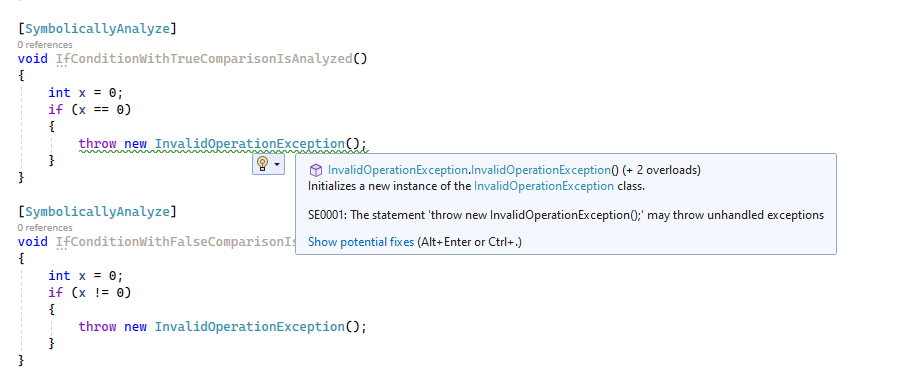
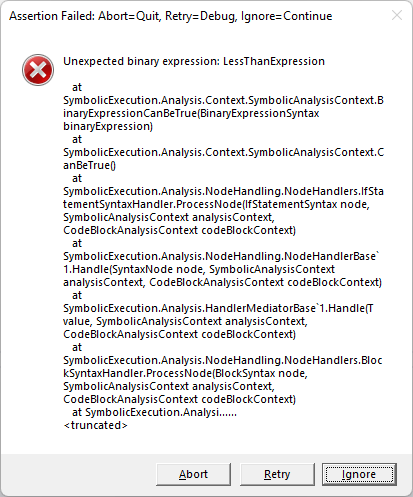

# Symbolic Execution Analyzer

[](https://codecov.io/gh/twtduck/symbolicexecution)

A C# analyzer which performs symbolic execution on users' code and determines if it will throw unhandled exceptions. 



## Usage

### Method 1: Nuget Package

**_Note: The Nuget package is not yet published. Nor has any testing been done with the nuget package built as part of this solution._**

### Method 2: Visual Studio Extension

**_Note: The Visual Studio extension is not yet published. This content is only applicable for users willing to download and build the extension from source (see "Contributing" below)._**

If using the extension and not the nuget package, the `SymbolicallyAnalyze` attribute does not exist. Simply create a file with the following contents:

```csharp
class SymbolicallyAnalyzeAttribute : Attribute { }
```

Then you can mark methods in your code with the attribute to have them analyzed by the extension. 

```csharp
class MyClass
{
	[SymbolicallyAnalyze]
	void MyMethod()
	{
	}
}
```

## Test coverage

Sunburst:

[](https://codecov.io/gh/twtduck/symbolicexecution/branch/master/graphs/sunbrust.svg)

Icicle:

[](https://codecov.io/gh/twtduck/symbolicexecution/branch/master/graphs/icicle.svg)

Tree:

[](https://codecov.io/gh/twtduck/symbolicexecution/branch/master/graphs/tree.svg)

## Contributing

### Requirements

Being a Roslyn analyzer and extension, you must have Visual Studio with the following components installed:

- .NET Compiler Platform SDK

To contribute, check out the git repository, open in Visual Studio 2022, and build solution. Running the `SymbolicExecution.Vsix` project should open a test instance of Visual Studio with the extension installed. Follow the directions in the "Method 2: Visual Studio Extension" section above to learn how to get started with this extension.

Alternatively, you can build the project from a separate IDE (such as Jetbrains Rider), but the `SymbolicExecution.Vsix` project must be unloaded, and only automated tests (in the `SymbolicExecution.Tests` project) can be used for testing. 

### Test with your own code

One of the best ways to contribute is to use the analyzer! As this project is still very young, there are a lot of C# language features that will cause it to fail. Look out for a dialog such as this when testing:



Alternatively (but hopefully less likely), there could be false positives or false negatives on the diagnostics produced by the analyzer. Please report these under issues, as they are going to be errors in existing code, and not just missing implementations. (See the following section.)

### Reporting Issues

Given that this project interacts with the C# language, but only supports a small subset of its features, there are likely going to be issues when using it. 

For language features which are not yet supported, the error dialog above is shown. The goal of this project is to eventually support the entire language, but we're a long way from being there. For now, please report the issue on our GitHub Issues page so it is documented. Be sure to include the **most basic version** of the code that produces the issue, or it will take much longer to add support for it.

Higher priority are existing errors in the analysis. These come in two forms:

- Statements which analyze without the error above, but contain statements which may throw but are not marked as warnings when analyzed. (False negatives)
- Statements which analyze without the error above, but contain statements which may not throw but are marked as warnings when analyzed. (False positives)

When reporting one of these, please mark the issue with the "false-negative" or "false-positive" tags.

That is, instead of pasting a 400-line method into the issue and saying that it won't analyze, please provide just the minimal code (typically a method less than 5 lines) to cause the error. For examples, see the existing issues that have been resolved. 

### Contributing code changes

Pull requests are very welcome for this project. 

Small changes, such as bug fixes or implementing a syntax without extensive changes are very encouraged. See the issues board for a list of wanted improvements. 

Quality-of-life tools (such as other analyzers to analyze this source code) are welcome, but please create a discussion topic for them before putting effort into making the changes and submitting a pull request. Similarly, architectural changes should be discussed before submitted in a pull request. This is mostly to save you contributors from feeling bummed out in case the pull request is declined. 
